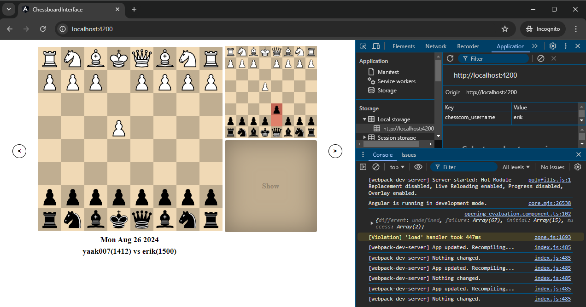

# ChessboardInterface

This is a chess program to help study chess openings. It helps check actual chess.com games with expected chess lines.

## How it works
Chess lines are placed in the `./assets/opening_lines.pgn`. Only a couple of lines are placed in the file publicly as a representation of how the chess lines should look. 

#### Sample opening_lines.pgn file
```text
1.e4 c6 2.d4 d5 3.e5 c5 4.c3 Nc6 5.Nf3 cxd4 6.cxd4 Bg4 7.Be2 e6 8.O-O Nge7 9.Nc3 Nf5 10.Be3 Be7 11.a3 Rc8 *
1.e4 c6 2.d4 d5 3.e5 c5 4.c3 Nc6 5.f4 cxd4 6.cxd4 h5 7.Nf3 Bg4 8.Be2 e6 9.O-O Nh6 
1.e4 c6 2.d4 d5 3.e5 c5 4.c3 Nc6 5.Bb5 Qa5 6.Bxc6+ bxc6 7.Bd2 Qb6 *
1.e4 c6 2.d4 d5 3.e5 c5 4.c3 Nc6 5.Be3 Nh6 6.Bxh6 gxh6 7.Nf3 Bg4 8.Be2 Bxf3 9.Bxf3 e6 10.O-O cxd4 11.cxd4 Qb6 *
```

## Setting Username

The username is set on the localstorage of the browser.

* Open Developer Tools on your browser.
* On the console tab paste `localStorage.setItem("chesscom_username", "username")` where username is your chess.com username.
* Refresh the page.





# Boiler-plate Angular

This project was generated with [Angular CLI](https://github.com/angular/angular-cli) version 16.1.6.

## Development server

Run `ng serve` for a dev server. Navigate to `http://localhost:4200/`. The application will automatically reload if you change any of the source files.

## Code scaffolding

Run `ng generate component component-name` to generate a new component. You can also use `ng generate directive|pipe|service|class|guard|interface|enum|module`.

## Build

Run `ng build` to build the project. The build artifacts will be stored in the `dist/` directory.

## Running unit tests

Run `ng test` to execute the unit tests via [Karma](https://karma-runner.github.io).

## Running end-to-end tests

Run `ng e2e` to execute the end-to-end tests via a platform of your choice. To use this command, you need to first add a package that implements end-to-end testing capabilities.

## Further help

To get more help on the Angular CLI use `ng help` or go check out the [Angular CLI Overview and Command Reference](https://angular.io/cli) page.
